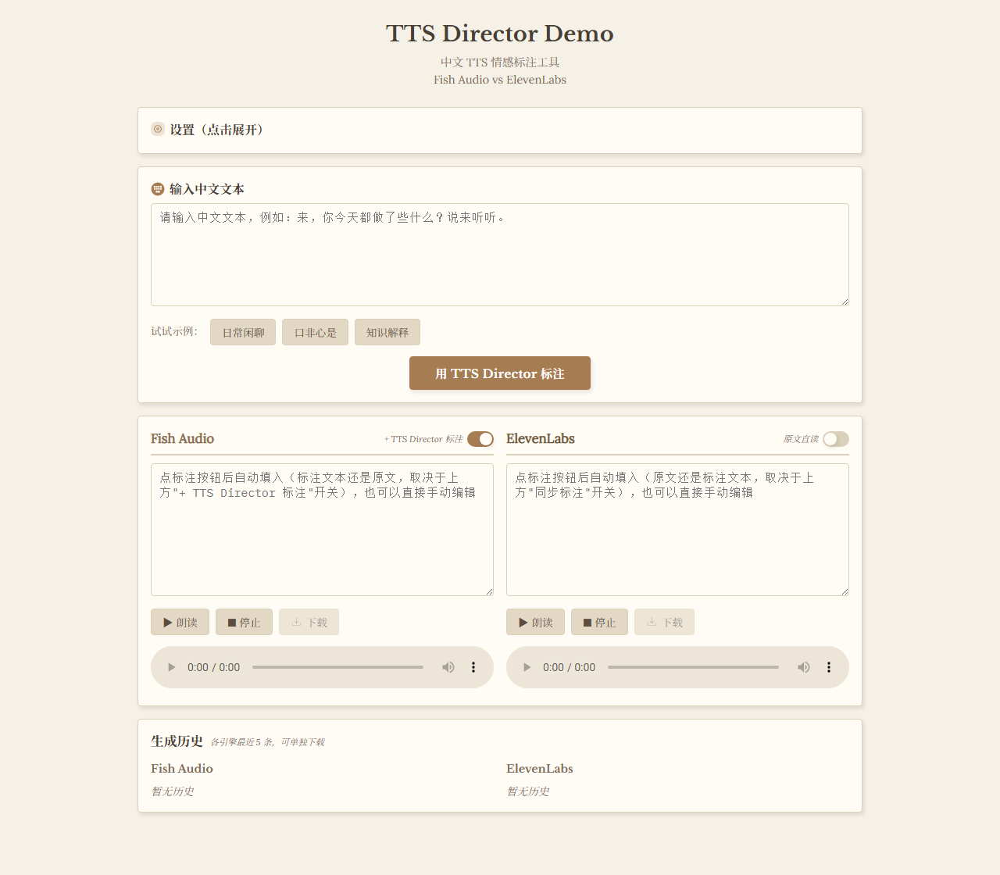

# TTS Director

一个给中文文本自动插入 [Fish Audio S2 Pro](https://fish.audio/) 的情感/韵律标签的skill，能够让机在对话的时候更像真人说话。标签语法是 Fish Audio S2 Pro 专用的，因为这个模型目前可以免费用，哈哈。

为了直观看效果，还做了一个 demo，默认对比"加了标注的 Fish Audio"和"原文直读的 ElevenLabs"，两栏也都可以单独切换成对方的模式（标注/原文）。

Demo在线地址：**https://ttsdirectorskill-chatting.onrender.com**。



## skill 的核心设计原则
- **专为 chatting 调整**：这个 skill 是针对情感陪伴 chatting 的情境做的，所以会尽量减少负面情绪的表达。
- **克制优先**：默认不标注，加标签要能说清楚"不加会有什么问题"，不是标签越多越好。
- **表里一致性判断**：要不要标、标多密，取决于文本表面语义和说话人真实意图之间的距离。离得越远（比如嘴上嫌弃心里关心），越需要标签把潜台词标出来；表里一致的平铺陈述，几乎不用标。
- **文本改写和标签插入同等重要**：断句、加语气词、调语序，经常比堆标签更有效。
- 标签选择经常是**反直觉**的：命令句通常要用软标签而不是硬标签，一本正经的冷面吐槽在 Fish Audio S2 Pro 上很难读出"嘴硬心软"的反差。

完整规则见 [SKILL.md](SKILL.md)，标签速查表见 [s2-pro-tags.md](s2-pro-tags.md)，输入输出对照样本见 [examples.md](examples.md)，多音字/多音词的发音修正见 [polyphone-checklist.md](polyphone-checklist.md)（按需读取，不是每次都要加载）。

## 目录结构

```
.
├── SKILL.md                    # skill 主文件：触发条件、标注流程、核心原则
├── s2-pro-tags.md               # 标签速查表
├── examples.md                  # 输入输出对照样本
├── polyphone-checklist.md       # 多音字音素控制速查表
├── CLAUDE.md                    # 给 Claude Code 看的项目说明 / 踩坑记录
├── docs/                        # README 里用到的截图等素材
└── demo/                        # 本地对比测试网页，见 demo/README.md
```

skill 的四个文件都平铺在仓库根目录，**不在** `skill/references/` 子目录下——如果你在别处看到引用 `references/xxx.md` 的写法，那是历史遗留路径，实际文件就在根目录。

## 怎么用这个 skill

在 Claude Code 里，把 `SKILL.md`、`s2-pro-tags.md`、`examples.md`、`polyphone-checklist.md` 这四个文件放进你项目（或用户级）的 skills 目录下（比如 `.claude/skills/tts-director/`），保持文件名不变即可——`SKILL.md` 的 frontmatter 里已经声明了 `name: tts-director`。之后在对应项目里让 Claude 处理需要合成语音的中文文本，符合触发条件时就会自动套用这套标注规则；具体的 skill 目录约定以 [Claude Code 官方文档](https://code.claude.com/docs)为准。

Kelivo 目前还没法直接把这个 skill 装进去。更适合的是自建前端，因为需要在"模型生成回复"和"喂给 TTS"之间，自己插入一次额外的标注调用。

具体怎么接，`demo/` 这个项目本身就是一份可以照抄的参考实现：`demo/server/skillPrompt.js` 在启动时读取仓库根目录的四份 skill 文件、拼接成一段 system prompt；`demo/server/routes/annotate.js` 拿这段 system prompt 配合固定的输出格式说明，去调用任意 Claude / OpenAI 兼容接口，解析出标注后的文本。放到你自己的前端里，链路大致是：

1. 用户消息 → 你的聊天模型 → 生成回复文本（这一步不变）。
2. 回复文本 → **额外一次** API 调用（system prompt = 拼接后的 skill 文件内容）→ 标注后的文本。
3. 标注后的文本 → Fish Audio S2 Pro API → 音频。

第 2 步的标注调用和生成聊天回复的模型是两次完全独立的 API 请求，模型可以选得不一样：聊天用你觉得效果好的主力模型，标注这一步换成更便宜/更快的模型也没问题，这样能省下一部分 token 成本。demo 里实测过用 `deepseek-v4-flash` 做标注模型，效果不错。

## Demo：对比 Fish Audio 和 ElevenLabs

在线直接试：**https://ttsdirectorskill-chatting.onrender.com**。

配好 Fish Audio / ElevenLabs / 标注引擎的 API Key（只存在你自己浏览器的 `localStorage` 里，不会传到别处、服务端不落盘）后：

- 一键用 skill 规则给输入文本打标签，流式返回，边生成边显示。
- 标注引擎不锁定 Claude，也可以填任意 OpenAI 兼容接口（DeepSeek、Moonshot、自建网关……）。
- Fish Audio、ElevenLabs 两栏标题旁都有"+ TTS Director 标注 / 原文直读"的开关，能分别切换每一栏听标注后还是原文的效果，方便对比。
- 生成的语音可以下载，页面最下面留着每个引擎最近 5 条的生成历史，也能单独下载。

也可以在自己电脑上本地跑（比如想改代码、调 skill，或者不想依赖那个公开链接）：

```bash
cd demo
npm install
npm start
```

打开 `http://localhost:3787`。详细说明见 [demo/README.md](demo/README.md)；项目里踩过的坑和实现上的取舍记录在 [CLAUDE.md](CLAUDE.md)。

